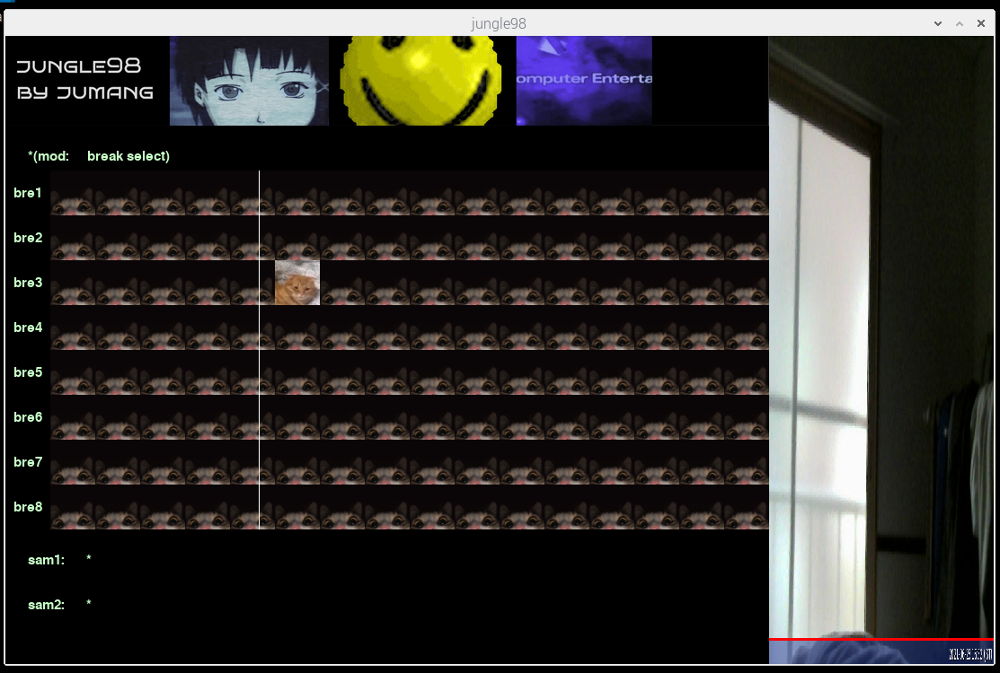

# jungle98.py

a sequencer which a school project(CN) written in python3

***⚠️caution⚠️: jungle98 code is REALLY DIRTY, that DO NOT REFERENCE THIS CODE INTO YOUR CODE***



# installation


## requirements

- raspberry pi
- python3-dev
- pygame
- pydub
- gpio
- spidev
- fswebcam

## terminal

```bash
git clone https://github.com/jumang4423/jungle98.git
cd jungle98
sudo pip3 install pygame pydub spidev
python3 jungle98.py
```

# overview

## functions

u can play yourself jungle with this jungle98.py!

- breaks, which drum patturn

- sample1, which for background embient 

- sample2, which is main synth

